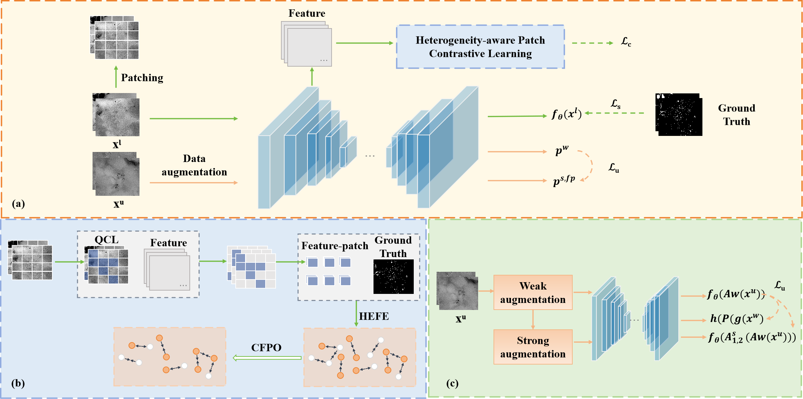

# HB-Net：Semi-Supervised Micro-Pore Segmentation for Heterogeneous Shale SEM Images

## Basic Project Information

- **Program Name**: HB-Net
- **Paper Title**: Semi-Supervised Micro-Pore Segmentation for Heterogeneous Shale SEM Images
- **Author Information**: 
  - First Author：Peigang Liu,School of Computer Science and Technology, China University of Petroleum (East China), Qingdao 266580, China,
  - Corresponding Author：Peigang Liu
  - Other Authors:：Jing Ma, Chaozhi Yang, Honghao Dong, Peijie Wang, Zongmin Li (arranged in the order of authors in the paper)
- **Open Source License**: [MIT License](https://github.com/mjsdf/HB-Net/blob/main/LICENSE)(see the LICENSE file in the root directory of the project for details)
- **Code Repository Address:**: https://github.com/mjsdf/HB-Net

## Project Overview
This project implements a semi-supervised learning-based semantic segmentation model (HB-Net), which is built on the UNet architecture and integrated with the UniMatch semi-supervised framework. It can efficiently handle semantic segmentation tasks in scenarios with limited annotated data (such as crack detection in geological images). The code supports distributed training and includes complete modules for dataset processing, model training, performance validation, and result testing, featuring excellent reproducibility, scalability, and maintainability.
<p align="left">

</p>

## Environmental Dependencies

### Basic Environment
- Operating System：Linux / Windows 10+
- Python Version：3.7+

### Installation
```bash
cd HBNet
conda create -n hbnet python=3.10.4
conda activate hbnet
pip install -r requirements.txt
pip install torch==1.12.1+cu113 torchvision==0.13.1+cu113 -f https://download.pytorch.org/whl/torch_stable.html
```

## Instruction guide
### 1.Data preparation  
#### Dataset Structure  
The data should be organized according to the following directory structure (taking pore segmentation as an example):
```
data/
├── images/       
│   ├── img_001.png
│   ├── img_002.png
│   └── ...
└── labels/          
    ├── img_001.png
    ├── img_002.png
    └── ...
splits/
├──train/
│   ├── labeled.txt  
│   ├── unlabeled.txt
├── train.txt
└── val.txt      
```
Note that the format of each line in the txt file is: images/img_001.png labels/img_001.png

#### Configuration File  
Create or modify the configuration file in the configs/ directory, as shown in the example below:
```
# arguments for dataset
dataset: liefeng2
nclass: 2
crop_size: 420
data_root: "./Data/liefeng2"

# arguments for training
epochs:  80
batch_size: 3 
lr: 0.005
lr_multi: 10.0

criterion: 
  name: OHEM 
  kwargs: 
    ignore_index: 255 
    thresh: 0.80 
    min_kept: 90000 
conf_thresh: 0.80 

# arguments for model
model: unet
backbone: False
```

### 2.Model training  
Use the unimatch.py script for semi-supervised training
```
# use torch.distributed.launch
sh scripts/train.sh <num_gpu> <port>

# or use slurm
# sh scripts/slurm_train.sh <num_gpu> <port> <partition>
```
Note：Some of the model's training logs have been uploaded to the "exp" folder, which can be used as a reference.

### 3.Model validation  
Use the val.py script to evaluate model performance on the validation set and generate prediction results (you need to specify the model path and configuration file in the script)：
```
python val.py
```

## Citation
Our method is implemented based on UniMatch.
```
@inproceedings{unimatch,
  title={Revisiting Weak-to-Strong Consistency in Semi-Supervised Semantic Segmentation},
  author={Yang, Lihe and Qi, Lei and Feng, Litong and Zhang, Wayne and Shi, Yinghuan},
  booktitle={CVPR},
  year={2023}
}
```
